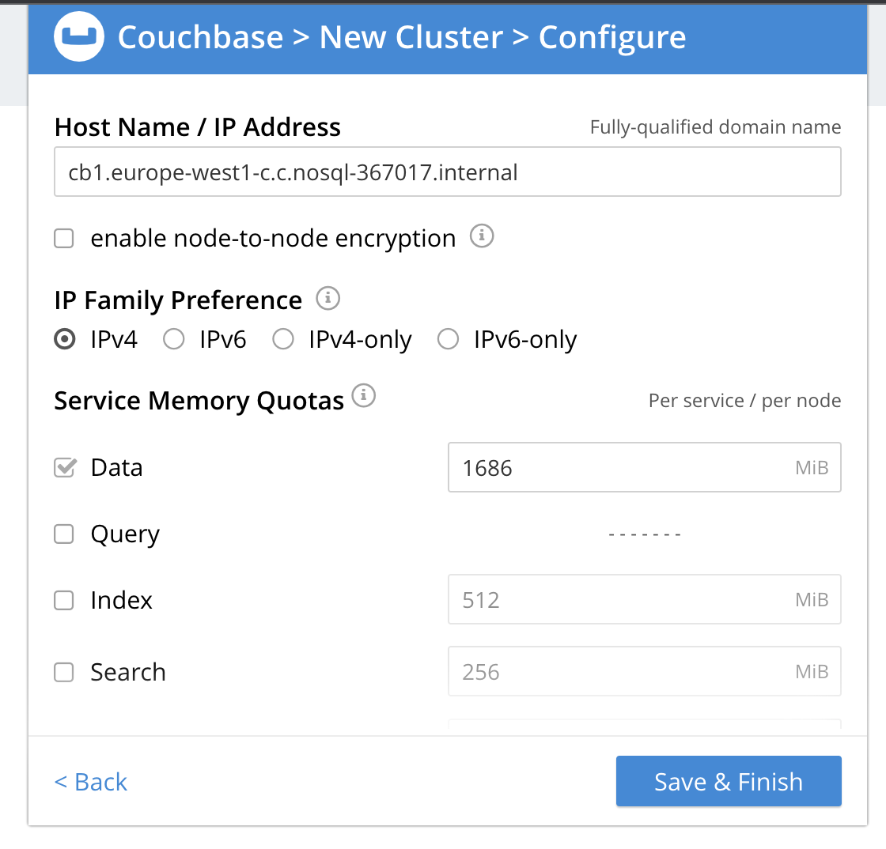
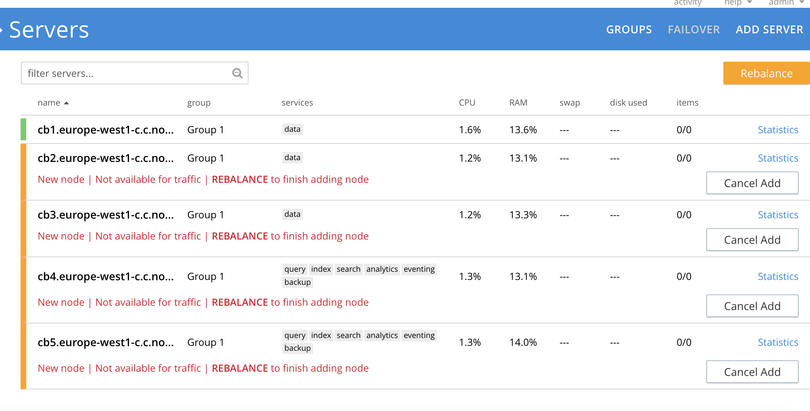

### Кластер Couchbase

1. Для построения кластера выбираем следующую схему с 5-ю ВМ:
```
cb1 = data
cb2 = data
cb3 = data
cb4 = index + query + search + analytics + eventing + backup
cb5 = index + query + search + analytics + eventing + backup
```

2. Создадим ВМ
```
for i in {1..5}; do gcloud compute --project=nosql-367017 instances create cb$i --zone europe-west1-c --machine-type=e2-medium --subnet=default --network-tier=PREMIUM --maintenance-policy=MIGRATE --service-account=1022317557791-compute@developer.gserviceaccount.com --scopes=https://www.googleapis.com/auth/cloud-platform --image-family=ubuntu-2004-lts --image-project=ubuntu-os-cloud --boot-disk-size=10GB --boot-disk-type=pd-ssd --boot-disk-device-name=cb$i --no-shielded-secure-boot --shielded-vtpm --shielded-integrity-monitoring --reservation-affinity=any & done;
```
Установим Couchbase на каждой ВМ
```
for i in {1..5}; do gcloud compute ssh cb$i --command='sudo apt-get update && sudo apt-get upgrade -y && curl -O https://packages.couchbase.com/releases/couchbase-release/couchbase-release-1.0-amd64.deb && sudo dpkg -i ./couchbase-release-1.0-amd64.deb && sudo apt-get update && sudo apt-get install couchbase-server -y && echo "export PATH=\$PATH:/opt/couchbase/bin/" >> .bashrc' & done;
```

3. Инициализируем кластер через UI. Для этого заходим на https://35.241.229.98:18091/ui/index.html


4. Поочередно добавляем ноды для требуемой конфигурации


5. Попробуем поработать через couchbase-cli. Перебалансируем кластер
```
kosten@cb1:~$ couchbase-cli rebalance -c cb1.europe-west1-c.c.nosql-367017.internal:8091 --username admin --password admin123
Rebalancing                                                                                         
Bucket: 00/00 ()                                                                    0 docs remaining
[==========================================================================================] 100.00%
SUCCESS: Rebalance complete
```

6. А теперь загрузим тестовый bucket и посмотрим его структуру
```
kosten@cb1:~$ curl -X POST -u admin:admin123 http://cb1.europe-west1-c.c.nosql-367017.internal:8091/sampleBuckets/install -d '["travel-sample"]'
kosten@cb1:~$ couchbase-cli bucket-list -c cb1.europe-west1-c.c.nosql-367017.internal:8091 --username admin --password admin123
travel-sample
 bucketType: membase
 numReplicas: 1
 ramQuota: 629145600
 ramUsed: 178589904
kosten@cb1:~$ couchbase-cli collection-manage --bucket travel-sample --list-scopes -c cb1.europe-west1-c.c.nosql-367017.internal:8091 --username admin --password admin123 
inventory
tenant_agent_00
tenant_agent_01
tenant_agent_02
tenant_agent_03
tenant_agent_04
_default
kosten@cb1:~$ couchbase-cli collection-manage --bucket travel-sample --list-collections -c cb1.europe-west1-c.c.nosql-367017.internal:8091 --username admin --password admin123 
Scope inventory:
    - airline
    - route
    - landmark
    - hotel
    - airport
Scope tenant_agent_00:
    - users
    - bookings
Scope tenant_agent_01:
    - users
    - bookings
Scope tenant_agent_02:
    - users
    - bookings
Scope tenant_agent_03:
    - users
    - bookings
Scope tenant_agent_04:
    - users
    - bookings
Scope _default:
    - _default
```

7. Попробуем подключиться через cbq
```
kosten@cb1:~$ cbq -c cb1.europe-west1-c.c.nosql-367017.internal:8091 -u admin -p admin123 
 Connected to : http://localhost:8091/. Type Ctrl-D or \QUIT to exit.

 Path to history file for the shell : /home/kosten/.cbq_history 
cbq> 
```
И запросить список стран, где есть аэропорты
```
cbq> select distinct country from `travel-sample`.inventory.airport;
{
    "requestID": "30d46a93-0411-4fa9-a6f9-133e99d96e22",
    "signature": {
        "country": "json"
    },
    "results": [
    {
        "country": "France"
    },
    {
        "country": "United States"
    },
    {
        "country": "United Kingdom"
    }
    ],
    "status": "success",
    "metrics": {
        "elapsedTime": "183.807815ms",
        "executionTime": "183.672199ms",
        "resultCount": 3,
        "resultSize": 120,
        "serviceLoad": 12
    }
}
```

8. Уроним машину cb2
```
gcloud compute ssh cb2 --command='sudo shutdown now'
```
Повторяем запрос и получаем ошибку по таймауту
```
cbq> select distinct country from `travel-sample`.inventory.airport;
{
    "requestID": "f9144b6a-4da8-4f4b-a46f-3d4ea5a63a7f",
    "signature": {
        "country": "json"
    },
    "results": [
    ],
    "errors": [
        {
            "code": 12008,
            "msg": "Error performing bulk get operation  - cause: {1 errors, starting with dial tcp 10.132.0.24:11210: i/o timeout}",
            "retry": true
        }
    ],
    "status": "errors",
    "metrics": {
        "elapsedTime": "20.623508654s",
        "executionTime": "20.62336868s",
        "resultCount": 0,
        "resultSize": 0,
        "serviceLoad": 12,
        "errorCount": 1
    }
}
```
Через 2 минуты сработал autoFailover и все снова заработало
```
cbq> select distinct country from `travel-sample`.inventory.airport;
{
    "requestID": "12550dee-f56c-4df4-b47e-7f3d9d5db28d",
    "signature": {
        "country": "json"
    },
    "results": [
    {
        "country": "France"
    },
    {
        "country": "United States"
    },
    {
        "country": "United Kingdom"
    }
    ],
    "status": "success",
    "metrics": {
        "elapsedTime": "162.94483ms",
        "executionTime": "162.851804ms",
        "resultCount": 3,
        "resultSize": 120,
        "serviceLoad": 12
    }
}
```

9. Уроним машину cb4
```
gcloud compute ssh cb4 --command='sudo shutdown now'
```
Повторяем запрос и получаем ошибку об отсутствии индекса в коллекции
```
cbq> select distinct country from `travel-sample`.inventory.airport;
{
    "requestID": "def376e8-b94d-4433-a96d-86d887568a51",
    "errors": [
        {
            "code": 4000,
            "msg": "No index available on keyspace `default`:`travel-sample`.`inventory`.`airport` that matches your query. Use CREATE PRIMARY INDEX ON `default`:`travel-sample`.`inventory`.`airport` to create a primary index, or check that your expected index is online."
        }
    ],
    "status": "fatal",
    "metrics": {
        "elapsedTime": "2.704519ms",
        "executionTime": "2.578677ms",
        "resultCount": 0,
        "resultSize": 0,
        "serviceLoad": 12,
        "errorCount": 1
    }
}
```
Теперь придется делать failover вручную, т.к квота autoFailover исчерпана
```
kosten@cb1:~$ couchbase-cli failover -c cb1.europe-west1-c.c.nosql-367017.internal:8091 --username admin --password admin123 --server-failover cb4.europe-west1-c.c.nosql-367017.internal:8091 --hard
SUCCESS: Server failed over
```
Повторяем запрос - ошибка об отсутствии индекса осталась. Похоже, падение ноды с индексами оказалось более болезненным, чем ноды с данными.
```
cbq> select distinct country from `travel-sample`.inventory.airport;
{
    "requestID": "4191431f-5680-4ee5-a7b5-f5a24da4687b",
    "errors": [
        {
            "code": 4000,
            "msg": "No index available on keyspace `default`:`travel-sample`.`inventory`.`airport` that matches your query. Use CREATE PRIMARY INDEX ON `default`:`travel-sample`.`inventory`.`airport` to create a primary index, or check that your expected index is online."
        }
    ],
    "status": "fatal",
    "metrics": {
        "elapsedTime": "984.928µs",
        "executionTime": "891.035µs",
        "resultCount": 0,
        "resultSize": 0,
        "serviceLoad": 12,
        "errorCount": 1
    }
}
```
Пробуем сделать rebalance
```
kosten@cb1:~$ couchbase-cli rebalance -c cb1.europe-west1-c.c.nosql-367017.internal:8091 --username admin --password admin123
Rebalancing                                                                                                                                                    
Bucket: 01/01 (travel-sample)                                                                                                                  0 docs remaining
[=====================================================================================================================================================] 100.00%
SUCCESS: Rebalance complete
```
Не помогло... Похоже, часть индексов мы все-таки потеряли.
Пересоздаем индекс
```
cbq> CREATE PRIMARY INDEX ON `default`:`travel-sample`.`inventory`.`airport` ;
{
    "requestID": "cdd4d032-61d9-47e9-9607-2760e5fb8851",
    "signature": null,
    "results": [
    ],
    "status": "success",
    "metrics": {
        "elapsedTime": "3.198224117s",
        "executionTime": "3.198132319s",
        "resultCount": 0,
        "resultSize": 0,
        "serviceLoad": 12
    }
}
```
Теперь запрос снова заработал
```
cbq> select distinct country from `travel-sample`.inventory.airport;
{
    "requestID": "da3a3528-b348-4468-8878-818d195feefe",
    "signature": {
        "country": "json"
    },
    "results": [
    {
        "country": "France"
    },
    {
        "country": "United States"
    },
    {
        "country": "United Kingdom"
    }
    ],
    "status": "success",
    "metrics": {
        "elapsedTime": "191.275825ms",
        "executionTime": "191.149832ms",
        "resultCount": 3,
        "resultSize": 120,
        "serviceLoad": 12
    }
}
```

9. Уроним вторую машину с индексами cb5
```
gcloud compute ssh cb5 --command='sudo shutdown now'
```
Повторяем запрос - теперь не получаем даже ошибки
```
cbq> select distinct country from `travel-sample`.inventory.airport;
cbq> 
```
Делаем failover вручную
```
kosten@cb1:~$ couchbase-cli failover -c cb1.europe-west1-c.c.nosql-367017.internal:8091 --username admin --password admin123 --server-failover cb5.europe-west1-c.c.nosql-367017.internal:8091 --hard
SUCCESS: Server failed over
```
Пробуем подключиться через cbq. Похоже, запросы всё... Но данные еще живы
```
kosten@cb1:~$ cbq -c cb1.europe-west1-c.c.nosql-367017.internal:8091 -u admin -p admin123 
 ERROR 100 : N1QL: No N1QL service found on this cluster 


 Path to history file for the shell : /home/kosten/.cbq_history 
cbq> 
```

10. Уроним машину с данными cb3
```
gcloud compute ssh cb3 --command='sudo shutdown now'
```
Попробуем выгрузить дынные из базы
```
kosten@cb1:~$ cbexport json -c cb1.europe-west1-c.c.nosql-367017.internal:8091 -u admin -p admin123 -b travel-sample --scope-field scope --collection-field collection -f lines -o data.json
2022-12-02T20:02:53.999+00:00 (Gocbcore) Pipeline Client 0xc00009f7a0 failed to bootstrap: check server ports and cluster encryption setting: dial tcp: lookup cb3.europe-west1-c.c.nosql-367017.internal: no such host
2022-12-02T20:02:59.020+00:00 (Gocbcore) Pipeline Client 0xc00009f7a0 failed to bootstrap: check server ports and cluster encryption setting: dial tcp: lookup cb3.europe-west1-c.c.nosql-367017.internal: no such host
2022-12-02T20:02:59.494+00:00 (Gocbcore) CCCPPOLL: Failed to retrieve CCCP config. check server ports and cluster encryption setting: dial tcp: lookup cb3.europe-west1-c.c.nosql-367017.internal: no such host
```
Всё - без ноды cb3 никак

11. Включаем cb3
```
gcloud compute instances start cb3
```
Теперь удалось вытащить данные
```
kosten@cb1:~$ cbexport json -c cb1.europe-west1-c.c.nosql-367017.internal:8091 -u admin -p admin123 -b travel-sample --scope-field scope --collection-field collection -f lines -o data.json
JSON exported to `data.json` successfully
Documents exported: 63288 Documents skipped: 0
```

12. Включаем cb5
```
gcloud compute instances start cb5
```
Возвращаем сервер в кластер и делаем rebalance
```
kosten@cb1:~$ couchbase-cli server-readd -c cb1.europe-west1-c.c.nosql-367017.internal:8091 --username admin --password admin123 --server-add cb5.europe-west1-c.c.nosql-367017.internal:8091 --server-username Administrator --server-password password
DEPRECATED: Please use the recovery command instead
SUCCESS: Servers recovered
kosten@cb1:~$ couchbase-cli rebalance -c cb1.europe-west1-c.c.nosql-367017.internal:8091 --username admin --password admin123
Rebalancing                                                                                                                                                    
Bucket: 01/01 (travel-sample)                                                                                                                  0 docs remaining
[=====================================================================================================================================================] 100.00%
SUCCESS: Rebalance complete
```
Теперь сервис запросов снова заработал
```
kosten@cb1:~$ cbq -c cb1.europe-west1-c.c.nosql-367017.internal:8091 -u admin -p admin123 
 Connected to : http://localhost:8091/. Type Ctrl-D or \QUIT to exit.

 Path to history file for the shell : /home/kosten/.cbq_history 
cbq> select distinct country from `travel-sample`.inventory.airport;
{
    "requestID": "1ea9087a-e015-4dfb-a51b-280864954be6",
    "signature": {
        "country": "json"
    },
    "results": [
    {
        "country": "France"
    },
    {
        "country": "United States"
    },
    {
        "country": "United Kingdom"
    }
    ],
    "status": "success",
    "metrics": {
        "elapsedTime": "185.373785ms",
        "executionTime": "185.255478ms",
        "resultCount": 3,
        "resultSize": 120,
        "serviceLoad": 12
    }
}
cbq> 
```
